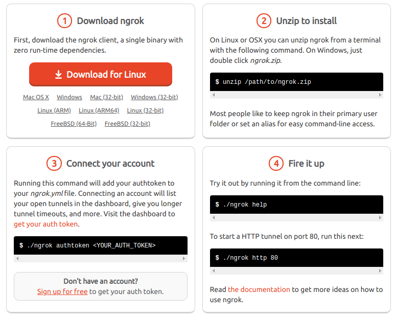
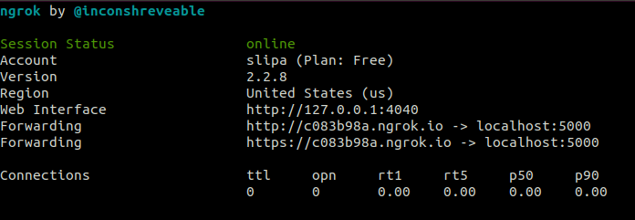

## ngrok 介紹與使用

一句話介紹ngrok:  **一個可以把你 localhost 對應到 https public domain 的服務**

例如說把你的 localhost:5000 對應到 https://fj2rijo3.ngrok.com

### 安裝 ngrok
1. 去ngrok [官網](https://ngrok.com/)註冊帳號
2. 下載ngrok
3. 設定好 auth token



### 使用ngrok
例如說把你的 localhost:5000 對應到 https://c083b98a.ngrok.io

```
$cd <path/to/gnrok>
$./ngrok http 5000
```


其中 https://c083b98a.ngrok.io 為自動產生，關掉terminal就消失了。外界可藉由該網址連到http://localhost:5000
